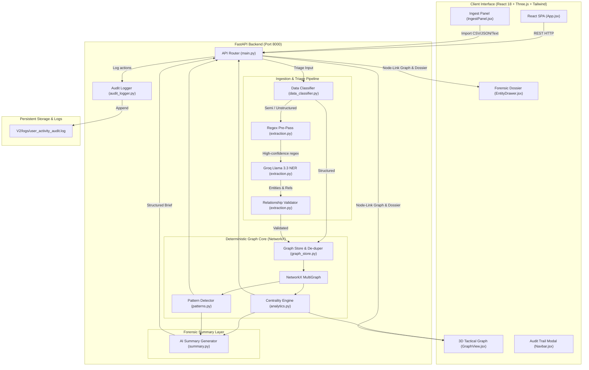

# NetTrace AI v2.0 — Criminal Network Intelligence & Syndicate Analysis

[](https://www.python.org/)
[](https://fastapi.tiangolo.com)
[](https://reactjs.org/)
[](https://vitejs.dev/)
[](https://threejs.org/)
[](https://tailwindcss.com/)
[](https://networkx.org/)
[](https://groq.com/)
[](#security-audit-logging--hardening)

**NetTrace AI v2.0** is an enterprise-grade investigative graph intelligence and crime syndicate analysis platform engineered for law enforcement agencies, cybercrime divisions, and forensic analysts. It seamlessly bridges **deterministic mathematical graph theory** (NetworkX) with **high-speed Large Language Model intelligence** (Groq / Llama 3.3 70B Versatile) and an interactive **3D Tactical Force-Directed Graph visualizer**.

---

## Table of Contents

- [Key Innovations & Capabilities](#key-innovations--capabilities)
- [Project Directory Structure](#project-directory-structure)
- [System Architecture & Data Flow](#system-architecture--data-flow)
- [Deterministic AI Boundary](#deterministic-ai-boundary)
- [Prerequisites & System Requirements](#prerequisites--system-requirements)
- [Quickstart Guide](#quickstart-guide)
  - [1. Backend API (FastAPI)](#1-backend-api-fastapi)
  - [2. Frontend Development Server (Vite)](#2-frontend-development-server-vite)
  - [3. Unified Production Deployment](#3-unified-production-deployment)
- [API Reference](#api-reference)
- [Environment Configuration](#environment-configuration)
- [Test Datasets & Verification Guide](#test-datasets--verification-guide)
- [Security, Audit Logging & Hardening](#security-audit-logging--hardening)
- [Developer Workflow & Guidelines](#developer-workflow--guidelines)
- [License & SIH Disclaimer](#license--sih-disclaimer)

---

## Key Innovations & Capabilities

### 1. Interactive 3D Tactical Graph Visualizer
- **Smooth 3D Orbit & Force-Directed Physics**: Built with Three.js and HTML5 Canvas for fluid rendering of dense syndicate networks.
- **Isolated Tactical Zooming**: Mouse wheel scroll and touch pinch zoom the 3D camera smoothly. Custom passive event interceptors guarantee that **the outer browser window never scrolls or zooms** when interacting with the canvas.
- **Silent Node Drag-and-Drop**: Reposition any suspect or vehicle in 3D space to isolate clusters without severing their topological relationships. Releasing a node after dragging suppresses the dossier drawer.
- **Double-Click Node Inspection**: Double-clicking any entity node immediately centers and summons its complete forensic dossier and 1-hop connected associates.
- **HUD Zoom Controls**: Dedicated physical Zoom In (`+`), Zoom Out (`-`), and Reset Zoom (`100%`) buttons with real-time percentage indicators.
- **Adaptive Node Highlighting**: Selected targets and their immediate 1-hop neighbors render with heavy bold font typography and glowing visual halos for maximum tactical clarity.

### 2. Multi-Modal Ingestion & Triage Engine
- **Zero-Configuration Ingestion**: Ingest CSV, JSON, raw text, police FIRs, call logs, or surveillance reports.
- **Automated Input Classification (`app/data_classifier.py`)**: Heuristically triages incoming data into **Structured** (direct relational schema), **Semi-Structured** (arbitrary CSV/JSON tables), or **Unstructured** (free-form prose).
- **Non-Destructive Entity De-duplication (`app/graph_store.py`)**: Merges phone numbers, aliases, and metadata when identical IDs, full names, or phone numbers are re-imported, preserving forensic history rather than overwriting existing records.
- **Relationship Deduplication**: Eliminates duplicate multi-edges between identical actors while merging evidentiary timestamps, notes, and event IDs.

### 3. Pure Algorithmic Pattern Detection & Graph Analytics
- **Degree & Betweenness Centrality**: Identifies operational leaders (high degree) and strategic cut-points / critical brokers (high betweenness) using NetworkX.
- **Suspicious Pattern Flags (`app/patterns.py`)**:
  - **Key Broker / Bridge**: High betweenness nodes connecting isolated sub-cliques.
  - **Dense Subgroup**: Highly interconnected cliques representing close-knit operation cells.
  - **Shared Infrastructure**: Multiple suspects sharing a single burner phone, vehicle license plate, bank account, or safehouse.
  - **High-Frequency Co-occurrence**: Entities repeatedly appearing together across distinct events or police reports.

### 4. Forensic Security Audit Logger
- **Immutable Activity Journal (`V2/logs/user_activity_audit.log`)**: Logs all investigator actions in the standard audit format:
  ```text
  [TIMESTAMP] Analyst_User :- look3d_graph: Navigated 3D tactical graph canvas
  [TIMESTAMP] Analyst_User :- double_click_node: Inspected entity E001 (Rakesh Verma)
  [TIMESTAMP] Analyst_User :- import_data: type=structured entities=12 rels=18
  [TIMESTAMP] Analyst_User :- reset_graph: Memory wiped, diagram cleared
  ```
- **In-App Real-Time Audit Viewer**: Instant modal accessible directly from the top navigation bar to inspect recent audit events.

### 5. Memory Management: Total Wipe vs. Demo Seed
- **Reset (Empty)**: Clears all memory (0 nodes, 0 edges) and presents an empty tactical overlay ready for fresh case imports.
- **Demo Case**: One-click restoration of the full sample crime syndicate network for training, demonstration, and algorithm verification.

---

## Project Directory Structure

```text
SIH_SynerCloud_NetTrace-20260913T171153Z-1-001/
│
├── .gitignore                     # Git ignore rules shielding keys, envs, venvs, and build outputs
├── README.md                      # Primary project documentation (this file)
│
├── frontend/                      # React 18 + Vite SPA source tree
│   ├── index.html                 # Main HTML template
│   ├── package.json               # Frontend dependencies & npm scripts
│   ├── package-lock.json          # Locked dependency graph
│   ├── postcss.config.js          # PostCSS configuration for TailwindCSS
│   ├── tailwind.config.js         # Cyberpunk/Tactical dark-mode styling tokens
│   ├── vite.config.js             # Vite bundler configuration & local dev proxy
│   ├── dist/                      # Compiled static production bundle (served by FastAPI)
│   └── src/
│       ├── main.jsx               # Application DOM bootstrap
│       ├── App.jsx                # Global state orchestrator, tabs, resets, & view switcher
│       ├── index.css              # Tailwind base, components, and scrollbar utility styles
│       ├── components/
│       │   ├── Navbar.jsx         # Header bar with node/edge counters, Audit Log, & Reset buttons
│       │   ├── GraphView.jsx      # High-performance Three.js/Canvas 3D graph view with HUD controls
│       │   ├── EntityDrawer.jsx   # Slide-out forensic dossier with 1-hop connections & evidence
│       │   ├── IngestPanel.jsx    # Multi-format data importer (File upload, Raw Text, CSV, JSON)
│       │   ├── CentralityTable.jsx# Ranked actor table (Degree & Betweenness Centrality)
│       │   ├── PatternsRadar.jsx  # Algorithmic suspicious pattern indicators & risk scores
│       │   ├── SummaryView.jsx    # Groq AI investigation narrative & tactical action plan
│       │   ├── FinancialView.jsx  # Money laundering flows, suspicious accounts & transfers
│       │   ├── TelecomView.jsx    # Call Detail Records (CDR), shared burners & tower logs
│       │   ├── VehiclesView.jsx   # Plate recognition, syndicate vehicles & co-travel tracking
│       │   ├── LocationsView.jsx  # Geolocation hubs, meeting points & safehouses
│       │   ├── TimelineView.jsx   # Temporal chronological breakdown of syndicate operations
│       │   ├── CommandHUD.jsx     # Tactical HUD filter overlay
│       │   └── LiveTicker.jsx     # Streaming event feed ticker
│       ├── services/
│       │   └── api.js             # Centralized Axios client & backend REST endpoints
│       └── utils/
│           └── colors.js          # Consistent color coding by entity type (Person, Phone, Vehicle, etc.)
│
└── V2/                            # FastAPI Backend Engine
    ├── .env                       # Local secrets (API keys, CORS origins — gitignored)
    ├── .env.example               # Safe environment configuration template
    ├── requirements.txt           # Python dependency specifications
    ├── README.md                  # Backend-specific architecture notes
    ├── logs/
    │   └── user_activity_audit.log# Immutable forensic activity log
    ├── app/
    │   ├── __init__.py            # Python package marker
    │   ├── main.py                # FastAPI app initialization, middleware, routes, & static mount
    │   ├── config.py              # Environment variable loader & configuration validation
    │   ├── models.py              # Pydantic schemas for requests, responses, entities, & patterns
    │   ├── data_classifier.py     # Heuristic data triage (structured / semi-structured / unstructured)
    │   ├── import_module.py       # Deterministic CSV and JSON parsers
    │   ├── extraction.py          # Dual-layer entity extractor: Regex pre-pass + Groq LLM NER
    │   ├── graph_store.py         # Thread-safe in-memory NetworkX MultiGraph store & de-duplicator
    │   ├── analytics.py           # NetworkX centrality calculation engine
    │   ├── patterns.py            # Graph-theoretic suspicious pattern algorithms
    │   ├── summary.py             # Groq AI forensic brief generation engine
    │   ├── ai_client.py           # Resilient Groq client wrapper with prompt injection guards
    │   ├── audit_logger.py        # File-based user activity logger & audit trail service
    │   └── sample_data.py         # Seed dataset definitions for the Black Lotus Syndicate
    └── testing/                   # Test datasets and verification fixtures
        ├── 01_entities.csv
        ├── 02_relationships.csv
        ├── 03_combined_case.json
        ├── 04_unstructured_case.txt
        ├── 05_repeated_events.txt
        ├── 06_shared_attribute_test.txt
        ├── 07_invalid_relationship.json
        ├── 08_simple_text.txt
        ├── 10_syndicate_black_lotus.json
        ├── 11_syndicate_entities.csv
        ├── 12_syndicate_relationships.csv
        ├── 13_syndicate_surveillance_brief.txt
        ├── 1_structured_entities.csv
        ├── 2_semi_structured_contacts.csv
        └── 3_unstructured_report.txt
```

---

## System Architecture & Data Flow



---

## Deterministic AI Boundary

In mission-critical criminal intelligence, **hallucinations and unpredictable probabilistic scores are intolerable**. NetTrace AI enforces a strict architectural boundary:

1. **Deterministic Graph Analytics**:
   - Centrality measures (Degree, Betweenness, Closeness) are calculated strictly via deterministic Python `networkx` routines.
   - Suspicious pattern flags (Bottlenecks, Cliques, Shared Infrastructure, Co-occurrence) are calculated purely through deterministic graph-traversal algorithms.
   - **The AI never computes, assigns, or modifies any risk score or graph metric.**
2. **Deterministic Pre-Parsing**:
   - Phone numbers (E.164 and local formats) and vehicle license plates are extracted via deterministic RegEx filters prior to any LLM invocation.
3. **Strict Relationship Referential Integrity**:
   - When the LLM extracts relationships from unstructured police narratives, the system rejects any relationship whose source or target is not in the extracted entity registry. Hallucinated ghost edges are dropped before touching the graph.
4. **Constrained AI Role**:
   - Large Language Models (Groq / Llama 3.3 70B) are strictly confined to two discrete tasks:
     - **Entity & Relation Extraction** from unstructured text.
     - **Investigative Synthesis**: Translating deterministic NetworkX metrics and pattern flags into readable narrative briefings for investigators.
5. **Prompt Injection Hardening**:
   - Untrusted ingested text is always delivered as isolated `user` turns within strict system instruction boundaries, preventing prompt overrides.

---

## Prerequisites & System Requirements

- **Operating System**: Windows 10/11, macOS, or Linux (Ubuntu 20.04+)
- **Python**: `3.10` or higher (`3.11`, `3.12`, or `3.14` supported)
- **Node.js**: `18.x` or higher (LTS recommended)
- **Package Managers**: `pip` (Python) and `npm` (Node.js)
- **Groq API Key**: A free API key from [Groq Console](https://console.groq.com/) for Llama 3.3 extraction and forensic briefing.

---

## Quickstart Guide

> [!NOTE]
> All commands use standard cross-platform CLI tools. There are **zero `.bat` files** in this repository.

### 1. Backend API (FastAPI)

1. Open a terminal and navigate to the backend directory:
   ```bash
   cd V2
   ```

2. Create and activate a Python virtual environment:
   - **Windows (PowerShell)**:
     ```powershell
     python -m venv .venv
     .venv\Scripts\Activate.ps1
     ```
   - **Linux / macOS**:
     ```bash
     python3 -m venv .venv
     source .venv/bin/activate
     ```

3. Install required Python packages:
   ```bash
   pip install -r requirements.txt
   ```

4. Configure your environment variables:
   ```bash
   # Copy the safe template
   cp .env.example .env
   ```
   Open `.env` and configure your `GROQ_API_KEY`:
   ```env
   GROQ_API_KEY=gsk_your_actual_groq_api_key_here
   GROQ_MODEL=llama-3.3-70b-versatile
   ```

5. Launch the FastAPI server:
   ```bash
   python -m uvicorn app.main:app --reload --port 8000
   ```
   - **API URL**: [http://127.0.0.1:8000](http://127.0.0.1:8000)
   - **Interactive Swagger Docs**: [http://127.0.0.1:8000/docs](http://127.0.0.1:8000/docs)
   - **System Healthcheck**: [http://127.0.0.1:8000/health](http://127.0.0.1:8000/health)

---

### 2. Frontend Development Server (Vite)

For active frontend development with Hot Module Replacement (HMR):

1. Open a second terminal and navigate to the frontend directory:
   ```bash
   cd frontend
   ```

2. Install Node dependencies:
   ```bash
   npm install
   ```

3. Start the Vite development server:
   ```bash
   npm run dev
   ```
   - **Development App**: [http://localhost:5173](http://localhost:5173)

---

### 3. Unified Production Deployment

You can compile the frontend into optimized static production assets that FastAPI serves directly on a single port (`8000`):

1. Build the frontend production bundle:
   ```bash
   cd frontend
   npm run build
   ```
   This generates the optimized bundle in `frontend/dist/`.

2. Start the FastAPI backend:
   ```bash
   cd ../V2
   python -m uvicorn app.main:app --port 8000
   ```

3. Open [http://127.0.0.1:8000/](http://127.0.0.1:8000/) in your web browser. The FastAPI server serves the compiled React application directly.

---

## API Reference

| Method | Endpoint | Description | Request Body / Parameters | Response Schema |
| :--- | :--- | :--- | :--- | :--- |
| `GET` | `/health` | System health, node/edge counts & Groq status | None | `{"status": "ok", "nodes": int, "edges": int, "groq_configured": bool}` |
| `POST` | `/api/audit/log` | Append officer activity to persistent security audit log | `{"user_id": str, "action": str, "details": str}` | `{"status": "recorded", "entry": str}` |
| `GET` | `/api/audit/trail` | Retrieve recent immutable audit trail records | Query: `limit=100` | `{"total_entries": int, "entries": list[str]}` |
| `POST` | `/api/import` | Ingest structured/semi-structured CSV/JSON or raw text | `{"type": "csv"|"json"|"text"|null, "content": str, "source_label": str}` | `ImportResponse` (counts, warnings, rejected rels) |
| `POST` | `/api/import/file` | Upload physical file (multipart/form-data) | Form: `file` (binary stream), `source_label` | `ImportResponse` |
| `GET` | `/api/graph` | Full graph as node-link JSON with computed centralities | None | `{"nodes": list[GraphNodeOut], "links": list[GraphLinkOut]}` |
| `GET` | `/api/graph/centrality` | Ranked actors by degree and betweenness centrality | None | `list[CentralityEntry]` |
| `GET` | `/api/graph/patterns` | Algorithmic suspicious pattern indicators | None | `list[PatternFlag]` |
| `GET` | `/api/graph/entity/{id}` | Detailed suspect dossier, 1-hop neighborhood & evidence | Path: `entity_id` | `EntityDetailResponse` |
| `GET` | `/api/graph/summary` | Groq AI generated narrative investigation brief | None | `{"summary": str, "key_suspects": list[str], "patterns_found": list[str], "recommended_actions": list[str]}` |
| `POST` | `/api/graph/reset` | Reset in-memory graph (empty by default) | Query: `load_sample=false` | `ImportResponse` |
| `POST` | `/api/graph/clear` | Completely wipe all entities and edges from memory | None | `ImportResponse` (0 nodes, 0 edges) |
| `POST` | `/api/graph/load-demo` | Clear memory and load the Black Lotus demo syndicate | None | `ImportResponse` (seed nodes and edges) |

---

## Environment Configuration

Configuration is managed through environment variables loaded from `V2/.env`:

| Variable | Type | Default | Description |
| :--- | :--- | :--- | :--- |
| `GROQ_API_KEY` | String | *(Required)* | Groq Cloud API key for ultra-fast Llama 3.3 inference. |
| `GROQ_MODEL` | String | `llama-3.3-70b-versatile` | LLM model identifier for entity extraction and summarization. |
| `CORS_ORIGINS` | List | `["http://localhost:5173", "http://127.0.0.1:5173"]` | Allowed CORS origins for browser security. |
| `MAX_UPLOAD_BYTES`| Integer| `10485760` (10 MB) | Maximum allowed file upload size to prevent memory exhaustion / DoS. |
| `MAX_TEXT_BYTES` | Integer | `5242880` (5 MB) | Maximum string payload size accepted via `POST /api/import`. |
| `AUDIT_LOG_PATH` | String | `logs/user_activity_audit.log` | Destination path for the immutable forensic audit log file. |

---

## Test Datasets & Verification Guide

The `V2/testing/` directory contains verified test fixtures for validating all aspects of the pipeline:

| File | Format | Purpose / Scenario Tested |
| :--- | :--- | :--- |
| `01_entities.csv` | CSV | Structured entity master table (Suspects, Phones, Vehicles, Accounts). |
| `02_relationships.csv` | CSV | Relational edge table mapping calls, transactions, and meetings. |
| `03_combined_case.json` | JSON | Complete multi-entity syndicate case with mixed node types. |
| `04_unstructured_case.txt` | Text | Unstructured surveillance field report for testing LLM extraction. |
| `05_repeated_events.txt` | Text | Multiple temporal meetings testing high-frequency co-occurrence. |
| `06_shared_attribute_test.txt` | Text | Co-travel and shared burner phone scenario testing bridge detection. |
| `07_invalid_relationship.json`| JSON | Negative test fixture with ghost node IDs (verifies rejection filters). |
| `10_syndicate_black_lotus.json`| JSON | Full enterprise-scale case fixture (25+ entities, 40+ links). |
| `11_syndicate_entities.csv` | CSV | Enterprise syndicate entity roster. |
| `12_syndicate_relationships.csv`| CSV | Enterprise syndicate interaction graph. |
| `13_syndicate_surveillance_brief.txt`| Text | Intercept transcripts and informant debriefings. |

### Testing with cURL:

```bash
# 1. Reset memory to empty state
curl -X POST http://127.0.0.1:8000/api/graph/reset

# 2. Import structured entities
curl -X POST http://127.0.0.1:8000/api/import/file \
  -F "file=@testing/01_entities.csv" \
  -F "source_label=case_alpha_entities"

# 3. Import structured relationships
curl -X POST http://127.0.0.1:8000/api/import/file \
  -F "file=@testing/02_relationships.csv" \
  -F "source_label=case_alpha_relationships"

# 4. Ingest an unstructured surveillance report
curl -X POST http://127.0.0.1:8000/api/import/file \
  -F "file=@testing/04_unstructured_case.txt" \
  -F "source_label=surveillance_log_04"

# 5. Inspect computed centrality rankings
curl http://127.0.0.1:8000/api/graph/centrality

# 6. Check detected suspicious pattern flags
curl http://127.0.0.1:8000/api/graph/patterns

# 7. Generate an AI investigative narrative summary
curl http://127.0.0.1:8000/api/graph/summary

# 8. View the audit trail
curl http://127.0.0.1:8000/api/audit/trail
```

---

## Security, Audit Logging & Hardening

NetTrace AI incorporates strict defensive security measures:

1. **Immutable User Activity Audit**:
   - Every read, import, drag, double-click inspection, and reset action is written to `V2/logs/user_activity_audit.log` via thread-safe append operations.
   - Logs cannot be modified or cleared through the API surface.
2. **Denial-of-Service (DoS) & Memory Shielding**:
   - File uploads are capped at `10 MB` (`MAX_UPLOAD_BYTES`).
   - Content strings are checked before allocation to prevent memory exhaustion attacks.
3. **Magic-Byte Binary Rejection**:
   - Uploads are scanned for binary magic bytes (e.g. `%PDF-`, `PK\x03\x04`, `\x89PNG`, `\xff\xd8\xff`). Binary files masquerading as `.txt` or `.csv` are rejected cleanly with HTTP 400.
4. **Environment Isolation**:
   - `.env` files are ignored by git to avoid accidental exposure of Groq API credentials.
   - `.env.example` provides a template without sensitive tokens.
5. **CORS Whitelisting**:
   - Restricts API access strictly to designated local frontend ports in development.

---

## Developer Workflow & Guidelines

### Code Quality & Guidelines
- **Python Code**: All backend code adheres strictly to PEP 8, typed via Pydantic v2 models.
- **Frontend Code**: Clean modular React components with Tailwind utility classes.
- **Cross-Platform Compatibility**: Do not introduce Windows-only `.bat` scripts or POSIX-only shell shortcuts. Always use standard `python -m ...` and `npm ...` commands.

### Rebuilding After Frontend Changes
If you modify code in `frontend/src/` and are serving via FastAPI's static mount on port 8000:
```bash
cd frontend
npm run build
```
FastAPI will immediately serve the updated assets upon page refresh.

---

## License & SIH Disclaimer

This project is developed as an investigative intelligence platform prototype for the **Smart India Hackathon (SIH)**. All sample identities, telephone records, bank account numbers, and license plates provided in `testing/` and `sample_data.py` are strictly fictitious and generated for algorithmic validation and demonstration purposes.
