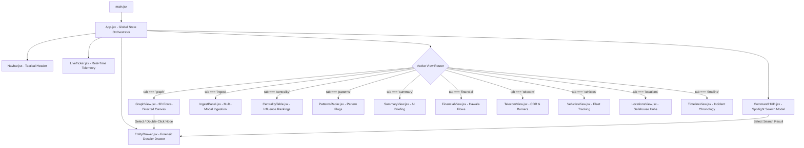

# NetTrace AI v2.0 — Tactical Frontend Console

[](https://reactjs.org/)
[](https://vitejs.dev/)
[](https://tailwindcss.com/)
[](https://lucide.dev/)
[](#interactive-3d-tactical-orbit-engine)
[](#security--telemetry)

The **NetTrace AI v2.0 Tactical Frontend Console** is a specialized, dark-themed Single Page Application (SPA) designed for law enforcement analysts, cybercrime detectives, and intelligence officers. It provides real-time multi-vector syndicate exploration, high-performance 3D force-directed network graph interaction, and deep forensic dossier examination.

---

## Table of Contents

- [Key Capabilities & UX Innovations](#key-capabilities--ux-innovations)
- [Directory & Component Layout](#directory--component-layout)
- [Component Architecture & Hierarchy](#component-architecture--hierarchy)
- [Interactive 3D Tactical Orbit Engine](#interactive-3d-tactical-orbit-engine)
- [Forensic Entity & Relationship Taxonomy](#forensic-entity--relationship-taxonomy)
- [State Management & Data Flow](#state-management--data-flow)
- [API Service Integration](#api-service-integration)
- [Setup & Development Scripts](#setup--development-scripts)
- [Production Build & Unified Deployment](#production-build--unified-deployment)
- [Performance & Engineering Highlights](#performance--engineering-highlights)
- [Security & Telemetry](#security--telemetry)

---

## Key Capabilities & UX Innovations

### 1. 3D Tactical Network Orbit (`GraphView.jsx`)
- **Fluid 3D Spatial Canvas**: Real-time 3D perspective projection with dynamic node repulsion, edge spring physics, and continuous 60 FPS auto-orbiting.
- **Isolated Tactical Zooming**: Mouse-wheel and trackpad pinch gestures within the canvas zoom the 3D camera smoothly. Custom non-passive event listeners guarantee that **the outer browser window never scrolls or zooms** when interacting with the graph.
- **Silent Drag-and-Drop Repositioning**: Reposition suspects, burner phones, or vehicles in 3D space to isolate operational cells without severing graph topology. Releasing a node after dragging suppresses the dossier modal.
- **Double-Click Dossier Centering**: Double-clicking any entity immediately centers the 3D camera on the target and summons its forensic dossier.
- **Physical HUD Zoom Controls**: Dedicated on-canvas buttons for Zoom In (`+`), Zoom Out (`-`), and Reset Zoom (`100%`) with live percentage tracking.
- **High-Contrast Typography**: Selected nodes and their immediate 1-hop connections render in heavy bold typography with bright glowing halos for instant tactical legibility.

### 2. Multi-Modal Ingestion Hub (`IngestPanel.jsx`)
- **Multi-Format Dropzone**: Ingest CSV, JSON, raw text, police FIRs, call records, or surveillance logs via file upload or direct text paste.
- **Auto-Detection Preview**: Surfaces the backend classifier triage (`structured`, `semi_structured`, or `unstructured`) directly to the user.
- **Pre-Packaged Tactical Templates**: Quick-load templates for structured suspect rosters, telecom call detail records (CDR), and surveillance field notes.

### 3. Comprehensive Investigative Modules
- **Influence & Brokers (`CentralityTable.jsx`)**: Ranked actor table by Degree (direct reach) and Betweenness Centrality (strategic cut-points / bridges).
- **Suspicious Pattern Radar (`PatternsRadar.jsx`)**: Real-time alerts for Articulation Brokers, Dense Cliques, Shared Burner/Vehicle Infrastructure, and Repeated Co-occurrence.
- **AI Forensic Briefing (`SummaryView.jsx`)**: Plain-English investigative briefing generated by Groq Llama 3.3, highlighting key suspects and recommended next steps.
- **Financial & Hawala (`FinancialView.jsx`)**: Transaction flow visualization tracking illicit money transfers and shell accounts.
- **Telecom & CDR (`TelecomView.jsx`)**: Call logs, cell tower ping clusters, and shared burner device analysis.
- **Vehicles & Fleet (`VehiclesView.jsx`)**: License plate tracking, vehicle ownership, and co-travel patterns.
- **Safehouses & Sites (`LocationsView.jsx`)**: Geographic meeting hubs, safehouses, and raid sites.
- **Incident Chronology (`TimelineView.jsx`)**: Temporal breakdown of syndicate operations across distinct events.
- **Spotlight Search (`CommandHUD.jsx`)**: Fast keyboard-driven command palette (`Ctrl+K` / `Cmd+K`) to jump directly to any suspect, plate, phone, or location.

### 4. Zero-Flicker Memory Management
- **Reset (Empty)**: Instantly clears all graph data (0 nodes, 0 edges) and presents a clean tactical empty overlay ready for fresh case ingestion.
- **Demo Case**: One-click restoration of the full Black Lotus crime syndicate dataset for training, demonstrations, and algorithm verification.

---

## Directory & Component Layout

```text
frontend/
│
├── index.html                 # Main application HTML shell
├── package.json               # Dependencies & build scripts
├── package-lock.json          # Locked dependency tree
├── postcss.config.js          # PostCSS configuration for Tailwind
├── tailwind.config.js         # Cyberpunk/Tactical styling design tokens
├── vite.config.js             # Vite bundler, HMR, & local backend proxy
│
├── dist/                      # Production build assets (served by FastAPI)
│   ├── index.html
│   └── assets/
│       ├── index-*.css
│       └── index-*.js
│
└── src/
    ├── main.jsx               # React DOM root mounting
    ├── App.jsx                # Global state orchestrator & view router
    ├── index.css              # Custom scrollbars, glow effects, & Tailwind utilities
    │
    ├── components/
    │   ├── Navbar.jsx         # Header bar with counters, Reset buttons, & Spotlight trigger
    │   ├── GraphView.jsx      # High-performance 3D force-directed canvas with HUD controls
    │   ├── EntityDrawer.jsx   # Slide-out forensic dossier with 1-hop connections & evidence
    │   ├── IngestPanel.jsx    # Multi-format data import hub
    │   ├── CentralityTable.jsx# Ranked actor table (Degree & Betweenness)
    │   ├── PatternsRadar.jsx  # Algorithmic pattern detection radar
    │   ├── SummaryView.jsx    # Groq AI investigation narrative & tactical action plan
    │   ├── FinancialView.jsx  # Hawala & suspicious transaction tracking
    │   ├── TelecomView.jsx    # CDR analysis & shared burner phone tracking
    │   ├── VehiclesView.jsx   # Plate recognition & syndicate fleet tracking
    │   ├── LocationsView.jsx  # Safehouse & meeting location tracking
    │   ├── TimelineView.jsx   # Chronological operational timeline
    │   ├── CommandHUD.jsx     # Global search palette (Ctrl+K)
    │   └── LiveTicker.jsx     # Streaming event feed ticker
    │
    ├── services/
    │   └── api.js             # Centralized Axios/fetch client for all backend endpoints
    │
    └── utils/
        └── colors.js          # Canonical color coding & badge definitions by entity type
```

---

## Component Architecture & Hierarchy



---

## Interactive 3D Tactical Orbit Engine

The core visualization engine in `GraphView.jsx` is built directly on HTML5 Canvas with custom 3D perspective math:

1. **Projection Math**: 3D world coordinates $(x, y, z)$ are projected to screen space $(sx, sy)$ using camera field-of-view and distance transforms:
   $$	ext{scale} = rac{f}{f + z'}$$
   $$sx = cx + x' \cdot 	ext{scale} \cdot 	ext{zoom}$$
   $$sy = cy + y' \cdot 	ext{scale} \cdot 	ext{zoom}$$
2. **Dynamic Level of Detail (LOD)**:
   - Primary nodes render with type-colored fills, halo borders, and inner icons.
   - Selected target and immediate 1-hop neighbors render with heavy bold font typography and pulsing target reticles.
   - Secondary background nodes scale down smoothly to maintain clear visual hierarchy.
3. **Decoupled Orbit Loop**: Continuous auto-rotation runs via `requestAnimationFrame` using mutable refs (`rotXRef`, `rotYRef`). This decouples the 60 FPS animation loop from React component state, completely eliminating re-render overhead.
4. **Zoom Event Isolation**: Custom non-passive wheel event listener prevents browser zoom chaining:
   ```javascript
   canvas.addEventListener('wheel', handleWheel, { passive: false });
   // Inside handler: e.preventDefault() guarantees outer page never scrolls
   ```
5. **Drag-vs-Click Discrimination**: Tracks drag displacement vector. If the mouse moved more than 4 pixels during the interaction, the gesture is identified as a node repositioning and the dossier drawer is suppressed on mouse release.

---

## Forensic Entity & Relationship Taxonomy

Defined centrally in `src/utils/colors.js`:

| Entity Type | Visual Theme | Hex Code | Purpose |
| :--- | :--- | :--- | :--- |
| `Person` | Indigo Glow | `#6366f1` | Suspects, couriers, kingpins, and known associates |
| `PhoneNumber`| Purple / Violet | `#a855f7` | Burner phones, SIM cards, and intercepted lines |
| `Vehicle` | Amber / Gold | `#f59e0b` | Transport vehicles, getaway cars, and logistics trucks |
| `Location` | Emerald Green | `#10b981` | Safehouses, meeting spots, raid sites, and ports |
| `Organization`| Cyan / Sky | `#06b6d4` | Front companies, hawala networks, and shell corps |
| `Event` | Rose / Crimson | `#f43f5e` | Incidents, secret meetings, drops, and transactions |

### Relationship Edge Styling

| Relation Type | Semantic Meaning | Visual Edge Color |
| :--- | :--- | :--- |
| `KNOWS` | Criminal association / acquaintance | Blue (`#60a5fa`) |
| `CALLED` | Telecom record (CDR) | Violet (`#c084fc`) |
| `MET_AT` | Physical meeting at venue | Emerald (`#34d399`) |
| `OWNS_VEHICLE` | Vehicle registration / driver | Amber (`#fbbf24`) |
| `MEMBER_OF` | Syndicate or corporate affiliation | Cyan (`#38bdf8`) |
| `LOCATED_AT` | Fixed address / site presence | Green (`#4ade80`) |
| `ASSOCIATED_WITH`| General evidentiary tie | Slate (`#94a3b8`) |

---

## State Management & Data Flow

Global application state is managed in `src/App.jsx`:

- `graphData`: Central `{ nodes: [], links: [] }` state fetched from `GET /api/graph`.
- `selectedEntity`: Currently inspected entity driving the slide-out `EntityDrawer`.
- `centralityList`: Ranked actor array from `GET /api/graph/centrality`.
- `patternFlags`: Detected pattern indicators from `GET /api/graph/patterns`.
- `theme`: Active visual palette (`'dark'` | `'light'` | `'midnight'`).
- `activeTab`: Current analytical view identifier.

### Tactical Reset Protocol
- Clicking **Reset (Empty)** calls `clearGraph()`, zeroing all arrays (`nodes: []`, `links: []`, `centralityList: []`, `patternFlags: []`, `selectedEntity: null`), transitioning the canvas into a clean empty HUD overlay.
- Clicking **Demo Case** invokes `loadDemoGraph()`, seeding the in-memory graph with the complete 25-node Black Lotus syndicate case.

---

## API Service Integration

Centralized in `src/services/api.js`:

```javascript
// Core Graph Queries
fetchGraph()            // GET /api/graph
fetchCentrality()       // GET /api/graph/centrality
fetchPatterns()         // GET /api/graph/patterns
fetchEntityDetail(id)   // GET /api/graph/entity/{id}
fetchSummary()          // GET /api/graph/summary

// Data Ingestion
importText(content, type, sourceLabel)  // POST /api/import
importFile(file, sourceLabel)           // POST /api/import/file

// Graph Memory Management
resetGraph(loadSample)  // POST /api/graph/reset
clearGraph()            // POST /api/graph/clear
loadDemoGraph()         // POST /api/graph/load-demo

// Background Activity Telemetry (Silent)
logAuditAction(action, details, userId) // POST /api/audit/log
```

---

## Setup & Development Scripts

### Prerequisites
- **Node.js**: `18.x` or higher (LTS recommended)
- **npm**: `9.x` or higher

> [!NOTE]
> All frontend tasks use standard cross-platform npm CLI commands. There are **zero `.bat` files** in this repository.

### 1. Install Dependencies
```bash
cd frontend
npm install
```

### 2. Start Local Development Server
```bash
npm run dev
```
- Development server starts at: [http://localhost:5173](http://localhost:5173)
- API requests to `/api/*` and `/health` are automatically proxied to the backend at `http://127.0.0.1:8000`.

### 3. Build Production Static Bundle
```bash
npm run build
```
- Compiles optimized static assets into `frontend/dist/`.
- Validates JavaScript syntax, transforms Tailwind CSS, and tree-shakes unused Lucide icons.

### 4. Preview Production Build Locally
```bash
npm run preview
```
- Launches a local preview server serving the compiled `dist/` bundle on port `4173`.

---

## Production Build & Unified Deployment

In production, the frontend does not require a separate Node.js server. FastAPI directly serves the compiled static bundle:

1. Compile the frontend:
   ```bash
   cd frontend
   npm run build
   ```
2. Launch the FastAPI backend:
   ```bash
   cd ../V2
   python -m uvicorn app.main:app --port 8000
   ```
3. Access the application directly at [http://127.0.0.1:8000/](http://127.0.0.1:8000/). FastAPI's static mount serves `dist/index.html` and bundled assets on a single unified port.

---

## Performance & Engineering Highlights

1. **Zero-Overhead 60 FPS Orbit**: Camera coordinates use mutable ref pointers instead of React state variables, preventing 60 re-renders per second.
2. **Passive Wheel Override**: Canvas events use `{ passive: false }` with `e.preventDefault()` to prevent browser zoom chaining while maintaining 120Hz smooth trackpad gestures.
3. **Small Bundle Footprint**: Pure React + Canvas architecture without heavy WebGL engines keeps the production JavaScript bundle under **310 kB** (~80 kB gzipped).
4. **Resilient Error Boundaries**: Backend service dropouts degrade gracefully, displaying offline badges without breaking the interactive canvas.

---

## Security & Telemetry

- **Developer-Only Activity Logging**: The web UI contains **no visible audit log modals or buttons**. User interactions (camera orbit, node dragging, double-click inspection, data imports, and resets) are silently transmitted in the background via `logAuditAction()` to the server-side log file (`V2/logs/user_activity_audit.log`) for forensic accountability.
- **Client-Side Secret Isolation**: No API keys (Groq or other credentials) ever touch the frontend code or browser bundle. All intelligence extraction and briefing is mediated strictly through backend REST endpoints.
- **Input Sanitization**: Ingested files and text inputs are validated for size before submission to shield against client memory exhaustion.
